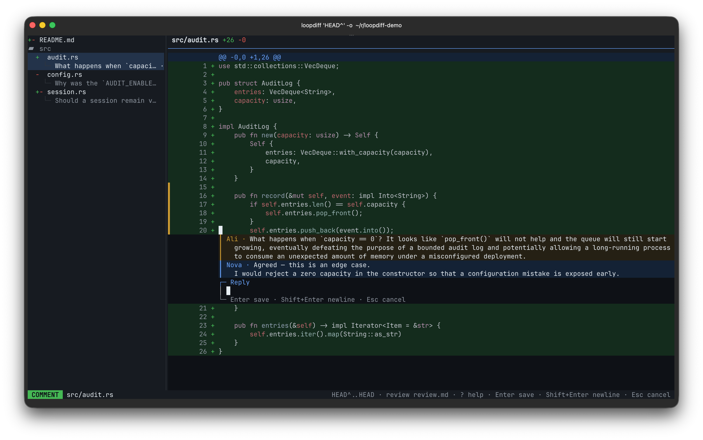

# μdiff

Reviewing what a coding agent wrote is harder than reviewing what a person
wrote. It writes faster than you can read, touches files you were not thinking
about, and delivers everything at once, so there is no natural moment to stop
and look. Keeping track of what you have already checked is on you, and so is
explaining where the problems are — by file and line, in prose. Skimming and
accepting is easier, which is how unreviewed code gets in.

μdiff exists for that review. It shows the agent's edits in batches as they
land instead of one wall at the end, remembers which files you have signed off,
and lets you attach a comment or a replacement to the exact lines that need
one. When you are done, one key copies the whole review as text the agent can
act on.



## When to use it

### Watching an agent work

Point μdiff at the directory the agent is editing and leave it open:

```bash
udiff --watch .
```

Each time the agent pauses, its edits arrive as a new revision. `{` and `}` move
between revisions, `Space` marks a file you are happy with, `c` selects lines you
are not, and `Shift+Y` copies every note you left — across every revision,
skipping the files you marked reviewed.

Paste that into the agent and it has your review in a form it can act on. Nothing
is written to disk and no repository is required, so it works on a scratch
directory as well as on a checkout.

### Reading your own changes before you commit

An hour of work is hard to remember in full. Read it before it becomes a commit:

```bash
git diff | udiff
git diff --staged | udiff
```

This is where the forgotten `dbg!`, the half-finished branch, and the file you
never meant to touch turn up.

### Reviewing a branch or a patch

```bash
git diff main..HEAD | udiff
cat changes.patch | udiff
```

Press `r` on a line to write a replacement instead of a comment. Suggestions come
out in GitHub's own review syntax, so they paste into a pull request unchanged.

### Comparing two files or directories

Useful for generated output, configuration that has drifted, or a before and
after:

```bash
diff -u old.rs new.rs | udiff
diff -ru old-dir/ new-dir/ | udiff
```

Git can do the same for files outside a repository:

```bash
git diff --no-index --no-color -- old.rs new.rs | udiff
```

## What you get back

`Shift+Y` copies your review as plain text. A comment:

```
1. src/main.rs (old lines 3; new lines 3-4)
Selected diff:
-old
+new
Comment: this allocation is redundant
```

A suggested replacement, in GitHub's syntax:

````
2. src/main.rs (new lines 12)
Selected diff:
+    let value = compute().unwrap();
Suggested replacement:
```suggestion
    let value = compute()?;
```
````

Comments live only for the current run. μdiff produces a review; it does not
store one.

## Install

```bash
brew install aliev/tap/udiff
```

macOS and Linux:

```bash
curl --proto '=https' --tlsv1.2 -LsSf \
  https://github.com/aliev/udiff/releases/latest/download/udiff-installer.sh | sh
```

Windows PowerShell:

```powershell
powershell -ExecutionPolicy Bypass -c "irm https://github.com/aliev/udiff/releases/latest/download/udiff-installer.ps1 | iex"
```

From source:

```bash
cargo install --path udiff --locked
```

## Keys

Press `?` for the full list. `j`/`k` and the arrows move, `Tab` switches between
the file list and the diff, `/` filters files, `q` quits.

## Notes

Copying uses OSC 52, so the terminal has to allow clipboard access from programs.

On a light terminal, set `UDIFF_THEME=light`. μdiff also honours `NO_COLOR`.

Feed μdiff an uncolored diff. Tools like `delta` emit terminal styling meant for
human eyes, which μdiff cannot parse — pipe it the original `git diff` instead.

`diff` and `git diff --no-index` exit with status `1` when they find differences.
A shell running with `pipefail` will report the whole pipeline as failed.

## Contributing

Start with [ARCHITECTURE.md](ARCHITECTURE.md), then
[CONTRIBUTING.md](CONTRIBUTING.md). Release notes live in
[CHANGELOG.md](CHANGELOG.md). μdiff is available under the
[MIT License](LICENSE).
